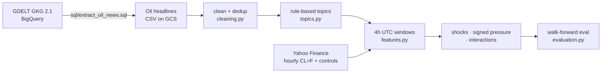

# Oil News → WTI Direction Signals

Can oil-market headlines tell you which way WTI crude moves over the next four hours?
This project turns raw [GDELT](https://www.gdeltproject.org/) news into interpretable,
topic-level signals and tests them with leakage-safe, walk-forward evaluation.

**Short answer:** generic daily sentiment doesn't work (AUC ≈ 0.5), but topic-specific
news intensity carries real signal for *large* 4-hour moves: **AUC 0.644** with a
regularized linear model.



## Results

Final stage: 209,923 cleaned headlines, 2026-02-15 → 2026-04-27, 4-hour UTC windows.
All numbers are pooled out-of-sample predictions from 5-fold expanding-window
(`TimeSeriesSplit`) evaluation.

| Sample | Windows | Best AUC |
|---|---:|---:|
| All 4h moves | 297 | 0.561 |
| Drop smallest 25% of moves | 223 | 0.608 |
| **Drop smallest 40% of moves** | **178** | **0.644** |

Best model (drop-40% sample): **LinearSVC, C = 0.05** on core topic counts + topic shocks +
signed pressure + interaction features: **accuracy 0.655 · balanced accuracy 0.611 · AUC 0.644**.

Other findings:

- **Daily horizon is noise.** Across 1,540 trading days, every daily news feature has
  |corr| < 0.035 with next-day returns, and daily classifiers sit at AUC ≈ 0.5.
- **Topics beat sentiment.** A missile strike is "negative" news but bullish for oil;
  a ceasefire is "positive" but bearish. Signed topic pressure captures this; FinBERT
  sentiment did not add lift.
- **Simple models win.** With < 300 samples, strongly regularized linear models were more
  stable than XGBoost, LightGBM, or random forests.

## What's in the box

| Module | Responsibility |
|---|---|
| [`sql/extract_oil_news.sql`](sql/extract_oil_news.sql) | BigQuery filter over GDELT GKG: oil anchor terms × market-driver groups, dedup, export to GCS |
| [`cleaning.py`](src/oilnews/cleaning.py) | UTC normalization, study-window filter, near-duplicate removal, irrelevant-"oil" filter |
| [`topics.py`](src/oilnews/topics.py) | Deterministic keyword → topic rules with a fixed priority order |
| [`features.py`](src/oilnews/features.py) | Per-window topic counts/sources/relevance, price features & target, past-only z-score shocks, signed pressure indices, interactions |
| [`evaluation.py`](src/oilnews/evaluation.py) | Walk-forward evaluation; per-fold imputation/scaling and threshold tuning on training data only |
| [`models.py`](src/oilnews/models.py) | Logistic (L1/L2), LinearSVC, Ridge, RF, XGBoost, LightGBM behind one factory |
| [`notebooks/`](notebooks/) | The original research notebooks (Colab), kept as the experiment log |

### Topic taxonomy

`hormuz_shipping` · `military_escalation` · `sanctions_exports` · `diplomacy_ceasefire` ·
`inventory_eia` · `opec_gulf_supply` · `macro_dollar_fed` · `demand_china_growth` ·
`other_oil_relevant`. The first five are the **core** topics used by the final model.

### Engineered signals

- **Topic shock**: z-score of the current window versus the previous 12 windows (~48h).
  Statistics are shifted one step, so a window never contributes to its own baseline
  (covered by `test_rolling_zscore_uses_only_the_past`).
- **Signed pressure**: `net_geo_oil_pressure = mean(military, hormuz, sanctions shocks) − diplomacy shock`.
- **Interactions**: net pressure × recent WTI volatility and lagged returns.

## Quickstart

```bash
python -m venv .venv && source .venv/bin/activate
pip install -e ".[dev,market]"
pytest                                   # 45 tests, synthetic data, < 10s

# 1. Build the 4h dataset (downloads hourly prices from Yahoo if --prices is omitted)
oilnews build-dataset --news data/headlines.csv --out data/direction_4h.csv

# 2. Run the feature ablation on the "drop smallest 40%" sample
oilnews ablate --dataset data/direction_4h.csv --filter-q 0.4 --out results/ablation.csv
```

`headlines.csv` needs `published_utc`, `title`, `source`, and `relevance_score` columns.
Raw data is not committed: GDELT is public on BigQuery (`gdelt-bq.gdeltv2.gkg_partitioned`),
and Yahoo Finance serves roughly the last 730 days of hourly bars.

## Limitations

- **Event-window design, not a trading strategy.** Features aggregate headlines published
  *during* window t, and the target is the close-to-close move over window t. This measures
  whether news flow is aligned with the concurrent move; a real-time system would lag the
  features by one window.
- **Meaningful-move filtering conditions on the realized move.** It answers "is news
  informative when the market actually moves?"; deploying it would require a separate
  model that predicts *whether* a large move is coming.
- **Small sample.** 178 windows over ~2 months of a single geopolitical regime; results
  should be read as evidence of signal, not as a stable edge. No transaction costs.

## Credits

Course project for EN.553.602 *Data Mining*, Johns Hopkins University (Spring 2026),
by Yang Song, Yunwei Chai, and Yining Li.
